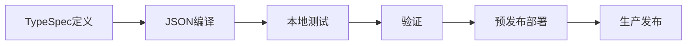

---
description: 针对使用schema v1.5、TypeSpec集成和Microsoft 365代理工具包工作流的Microsoft 365 Copilot声明式代理的全面开发指南
applyTo: "**.json, **.ts, **.tsp, **manifest.json, **agent.json, **declarative-agent.json"
---

# Microsoft 365声明式代理开发指南

## 概述

Microsoft 365 Copilot声明式代理是强大的自定义AI助手，可扩展Microsoft 365 Copilot的功能，提供专业能力、企业数据访问和自定义行为。本指南提供了使用最新v1.5 JSON schema规范创建生产就绪代理的全面开发实践，并完全集成Microsoft 365代理工具包。

## schema规范v1.5

### 核心属性

```json
{
  "$schema": "https://developer.microsoft.com/json-schemas/copilot/declarative-agent/v1.5/schema.json",
  "version": "v1.5",
  "name": "字符串（最大100个字符）",
  "description": "字符串（最大1000个字符）", 
  "instructions": "字符串（最大8000个字符）",
  "capabilities": ["数组（最多5个元素）"],
  "conversation_starters": ["数组（最多4个元素，可选）"]
}
```

### 字符限制与约束
- **名称**：最大100个字符，必填
- **描述**：最大1000个字符，必填  
- **指令**：最大8000个字符，必填
- **能力**：最多5个元素，最少1个元素
- **对话启动器**：最多4个元素，可选

## 可用能力

### 核心能力
1. **WebSearch**：网络搜索和实时信息访问
2. **OneDriveAndSharePoint**：文件访问、文档搜索、内容管理
3. **GraphConnectors**：从第三方系统集成企业数据
4. **MicrosoftGraph**：访问Microsoft 365服务和数据

### 通信与协作
5. **TeamsAndOutlook**：Teams聊天、会议、电子邮件集成
6. **CopilotForMicrosoft365**：高级Copilot功能和工作流

### 业务应用
7. **PowerPlatform**：Power Apps、Power Automate、Power BI集成
8. **BusinessDataProcessing**：高级数据分析和处理
9. **WordAndExcel**：文档创建、编辑和分析
10. **EnterpriseApplications**：第三方业务系统集成
11. **CustomConnectors**：自定义API和服务集成

## Microsoft 365代理工具包集成

### VS Code扩展设置
```bash
# 安装Microsoft 365代理工具包
# 扩展ID：teamsdevapp.ms-teams-vscode-extension
```

### TypeSpec开发工作流

#### 1. 现代代理定义
```typespec
import "@typespec/json-schema";

using TypeSpec.JsonSchema;

@jsonSchema("/schemas/declarative-agent/v1.5/schema.json")
namespace DeclarativeAgent;

/** Microsoft 365声明式代理 */
model Agent {
  /** schema版本 */
  @minLength(1)
  $schema: "https://developer.microsoft.com/json-schemas/copilot/declarative-agent/v1.5/schema.json";
  
  /** 代理版本 */
  version: "v1.5";
  
  /** 代理名称（最大100个字符） */
  @maxLength(100)
  @minLength(1)
  name: string;
  
  /** 代理描述（最大1000个字符） */
  @maxLength(1000)
  @minLength(1)  
  description: string;
  
  /** 代理指令（最大8000个字符） */
  @maxLength(8000)
  @minLength(1)
  instructions: string;
  
  /** 代理能力（1-5个元素） */
  @minItems(1)
  @maxItems(5)
  capabilities: AgentCapability[];
  
  /** 对话启动器（最多4个元素） */
  @maxItems(4)
  conversation_starters?: ConversationStarter[];
}

/** 可用的代理能力 */
union AgentCapability {
  "WebSearch",
  "OneDriveAndSharePoint", 
  "GraphConnectors",
  "MicrosoftGraph",
  "TeamsAndOutlook",
  "PowerPlatform",
  "BusinessDataProcessing",
  "WordAndExcel",
  "CopilotForMicrosoft365",
  "EnterpriseApplications",
  "CustomConnectors"
}

/** 对话启动器定义 */
model ConversationStarter {
  /** 启动文本（最大100个字符） */
  @maxLength(100)
  @minLength(1)
  text: string;
}
```

#### 2. 编译为JSON
```bash
# 将TypeSpec编译为JSON清单
tsp compile agent.tsp --emit=@typespec/json-schema
```

### 环境配置

#### 开发环境
```json
{
  "name": "${DEV_AGENT_NAME}",
  "description": "开发版本: ${AGENT_DESCRIPTION}",
  "instructions": "${AGENT_INSTRUCTIONS}",
  "capabilities": ["${REQUIRED_CAPABILITIES}"]
}
```

#### 生产环境
```json
{
  "name": "${PROD_AGENT_NAME}",
  "description": "${AGENT_DESCRIPTION}",
  "instructions": "${AGENT_INSTRUCTIONS}",
  "capabilities": ["${PRODUCTION_CAPABILITIES}"]
}
```

## 开发最佳实践

### 1. 模式验证
```typescript
// 验证v1.5模式
const schema = await fetch('https://developer.microsoft.com/json-schemas/copilot/declarative-agent/v1.5/schema.json');
const validator = new JSONSchema(schema);
const isValid = validator.validate(agentManifest);
```

### 2. 字符限制管理
```typescript
// 验证辅助函数
function validateName(name: string): boolean {
  return name.length > 0 && name.length <= 100;
}

function validateDescription(description: string): boolean {
  return description.length > 0 && description.length <= 1000;
}

function validateInstructions(instructions: string): boolean {
  return instructions.length > 0 && instructions.length <= 8000;
}
```

### 3. 能力选择策略
- **从简单开始**：从1-2个核心能力开始
- **逐步添加**：根据用户反馈添加能力
- **性能测试**：彻底测试每种能力组合
- **企业就绪性**：考虑合规性和安全性影响

## 代理游乐场测试

### 本地测试设置
```bash
# 启动代理游乐场
npm install -g @microsoft/agents-playground
agents-playground start --manifest=./agent.json
```

### 测试场景
1. **能力验证**：测试声明的每种能力
2. **对话流程**：验证对话启动器
3. **错误处理**：测试无效输入和边缘情况
4. **性能**：测量响应时间和可靠性

## 部署与生命周期管理

### 1. 开发生命周期


### 2. 版本管理
```json
{
  "name": "MyAgent v1.2.0",
  "description": "具备增强功能的生产代理",
  "version": "v1.5",
  "metadata": {
    "version": "1.2.0",
    "build": "20241208.1",
    "environment": "生产"
  }
}
```

### 3. 环境推广
- **开发**：完整调试，详细日志
- **预发布**：生产环境模拟测试，性能监控  
- **生产**：优化性能，最小化日志

## 高级功能

### 行为覆盖
```json
{
  "instructions": "您是一个专业的财务分析代理。始终为财务建议提供免责声明。",
  "behavior_overrides": {
    "response_tone": "专业",
    "max_response_length": 2000,
    "citation_requirements": true
  }
}
```

### 本地化支持
```json
{
  "name": {
    "en-US": "Financial Assistant",
    "es-ES": "Asistente Financiero",
    "fr-FR": "Assistant Financier"
  },
  "description": {
    "en-US": "提供财务分析和见解",
    "es-ES": "提供财务分析和见解",
    "fr-FR": "提供财务分析和见解"
  }
}
```

## 监控与分析

### 性能指标
- 每种能力的响应时间
- 用户对对话启动器的参与度
- 错误率和失败模式
- 能力使用统计

### 日志策略
```typescript
// 代理交互的结构化日志
const log = {
  timestamp: new Date().toISOString(),
  agentName: "MyAgent",
  version: "1.2.0",
  userId: "user123",
  capability: "WebSearch",
  responseTime: 1250,
  success: true
};
```

## 安全与合规

### 数据隐私
- 实现敏感信息的适当处理
- 确保符合GDPR、CCPA和组织政策
- 为企业能力设置适当的访问控制

### 安全注意事项  
- 验证所有输入和输出
- 实施速率限制和滥用预防
- 监控可疑活动模式
- 定期进行安全审计和更新

## 故障排除

### 常见问题
1. **模式验证错误**：检查字符限制和必填字段
2. **能力冲突**：验证能力组合是否支持
3. **性能问题**：监控响应时间并优化指令
4. **部署失败**：验证环境配置和权限

### 调试工具
- TypeSpec编译器诊断
- 代理游乐场调试
- Microsoft 365代理工具包日志
- 模式验证工具

本全面指南确保使用完整的TypeSpec和Microsoft 365代理工具包集成，构建强大、可扩展且可维护的Microsoft 365 Copilot声明式代理。