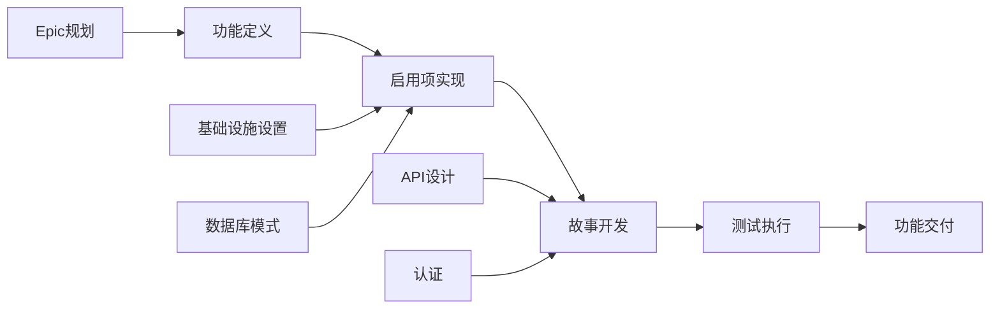

---
agent: 'agent'
description: '生成包含史诗 > 功能 > 故事/启用项 > 测试层级的全面项目计划的提示，包括依赖关系、优先级和自动化跟踪。'
---

# GitHub 问题规划与项目自动化提示

## 目标

扮演一位具有敏捷方法论和GitHub项目管理经验的高级项目经理和DevOps专家。您的任务是根据完整的功能工件（PRD、用户体验设计、技术分解、测试计划）生成一个全面的GitHub项目计划，包括自动化问题创建、依赖关系链接、优先级分配以及看板式跟踪。

## GitHub项目管理最佳实践

### 敏捷工作项层级

- **史诗（Epic）**：跨越多个功能的大型业务能力（里程碑级别）
- **功能（Feature）**：在史诗中交付的用户可见功能
- **故事（Story）**：独立交付价值的用户需求
- **启用项（Enabler）**：支持故事的技术基础设施或架构工作
- **测试（Test）**：验证故事和启用项的质量保障工作
- **任务（Task）**：故事/启用项的实施级工作分解

### 项目管理原则

- **INVEST标准**：独立、可协商、有价值、可估算、小规模、可测试
- **就绪定义（Definition of Ready）**：在工作开始前明确验收标准
- **完成定义（Definition of Done）**：质量门和完成标准
- **依赖管理**：明确阻塞关系和关键路径识别
- **基于价值的优先级排序**：用于决策的业务价值与工作量矩阵

## 输入要求

在使用此提示前，请确保已具备完整的测试流程工件：

### 核心功能文档

1. **功能PRD**：`/docs/ways-of-work/plan/{epic-name}/{feature-name}.md`
2. **技术分解**：`/docs/ways-of-work/plan/{epic-name}/{feature-name}/technical-breakdown.md`
3. **实施计划**：`/docs/ways-of-work/plan/{epic-name}/{feature-name}/implementation-plan.md`

### 相关规划提示

- **测试规划**：使用 `plan-test` 提示生成全面的测试策略、质量保障规划和测试问题创建
- **架构规划**：使用 `plan-epic-arch` 提示生成系统架构和技术设计
- **功能规划**：使用 `plan-feature-prd` 提示生成详细的功能需求和规范

## 输出格式

创建两个主要交付成果：

1. **项目计划**：`/docs/ways-of-work/plan/{epic-name}/{feature-name}/project-plan.md`
2. **问题创建检查清单**：`/docs/ways-of-work/plan/{epic-name}/{feature-name}/issues-checklist.md`

### 项目计划结构

#### 1. 项目概述

- **功能摘要**：简要描述和业务价值
- **成功标准**：可衡量的成果和KPI
- **关键里程碑**：主要交付物的分解（不含时间线）
- **风险评估**：潜在障碍和缓解策略

#### 2. 工作项层级

```mermaid
graph TD
    A[Epic: {Epic名称}] --> B[Feature: {功能名称}]
    B --> C[Story 1: {用户故事}]
    B --> D[Story 2: {用户故事}]
    B --> E[Enabler 1: {技术工作}]
    B --> F[Enabler 2: {基础设施}]

    C --> G[Task: 前端实现]
    C --> H[Task: API集成]
    C --> I[Test: E2E场景]

    D --> J[Task: 组件开发]
    D --> K[Task: 状态管理]
    D --> L[Test: 单元测试]

    E --> M[Task: 数据库模式]
    E --> N[Task: 迁移脚本]

    F --> O[Task: CI/CD流水线]
    F --> P[Task: 监控设置]
```

#### 3. GitHub问题分解

##### 大型问题（史诗）模板

```markdown
# Epic: {Epic名称}

## Epic描述

{从PRD中提取的Epic摘要}

## 业务价值

- **主要目标**：{主要业务目标}
- **成功指标**：{KPI和可衡量成果}
- **用户影响**：{用户如何受益}

## Epic验收标准

- [ ] {高层次需求1}
- [ ] {高层次需求2}
- [ ] {高层次需求3}

## 本史诗包含的功能

- [ ] #{feature-issue-number} - {功能名称}

## 完成标准

- [ ] 所有功能故事完成
- [ ] 端到端测试通过
- [ ] 性能基准达标
- [ ] 文档更新
- [ ] 用户验收测试完成

## 标签

`epic`, `{优先级}`, `{价值层级}`

## 里程碑

{发布版本/日期}

## 估算

{史诗级T恤尺码：XS, S, M, L, XL, XXL}
```

##### 功能级问题模板

```markdown
# Feature: {功能名称}

## 功能描述

{从PRD中提取的功能摘要}

## 本功能包含的用户故事

- [ ] #{story-issue-number} - {用户故事标题}
- [ ] #{story-issue-number} - {用户故事标题}

## 技术启用项

- [ ] #{enabler-issue-number} - {启用项标题}
- [ ] #{enabler-issue-number} - {启用项标题}

## 依赖关系

**阻塞**：{本功能阻塞的问题列表}
**被阻塞**：{阻塞本功能的问题列表}

## 验收标准

- [ ] {功能级需求1}
- [ ] {功能级需求2}

## 完成标准

- [ ] 所有用户故事交付
- [ ] 技术启用项完成
- [ ] 集成测试通过
- [ ] 用户体验评审通过
- [ ] 性能测试完成

## 标签

`feature`, `{优先级}`, `{价值层级}`, `{组件名称}`

## Epic

#{epic-issue-number}

## 估算

{故事点：1, 2, 3, 5, 8}
```

##### 用户故事级问题模板

```markdown
# 用户故事: {故事标题}

## 故事陈述

作为 **{用户类型}**，我希望 **{目标}**，以便 **{收益}**。

## 验收标准

- [ ] {可测试的具体需求1}
- [ ] {可测试的具体需求2}
- [ ] {可测试的具体需求3}

## 技术任务

- [ ] #{task-issue-number} - {实现任务}
- [ ] #{task-issue-number} - {集成任务}

## 测试需求

- [ ] #{test-issue-number} - {测试实现}

## 依赖关系

**被阻塞**：{必须首先完成的依赖问题}

## 完成标准

- [ ] 验收标准达成
- [ ] 代码评审通过
- [ ] 单元测试编写并通过
- [ ] 集成测试通过
- [ ] 用户体验设计实施
- [ ] 可访问性需求达成

## 标签

`user-story`, `{优先级}`, `前端/后端/全栈`, `{组件名称}`

## Feature

#{feature-issue-number}

## 估算

{故事点或工作量估算}
```

##### 技术启用项级问题模板

```markdown
# 技术启用项: {启用项标题}

## 启用项描述

{支持用户故事所需的技术工作}

## 技术需求

- [ ] {技术需求1}
- [ ] {技术需求2}

## 实现任务

- [ ] #{task-issue-number} - {实现细节}
- [ ] #{task-issue-number} - {基础设施设置}

## 支持的用户故事

此启用项支持：

- #{story-issue-number} - {故事标题}
- #{story-issue-number} - {故事标题}

## 验收标准

- [ ] {技术验证1}
- [ ] {技术验证2}
- [ ] 性能基准达标

## 完成标准

- [ ] 实现完成
- [ ] 单元测试编写
- [ ] 集成测试通过
- [ ] 文档更新
- [ ] 代码评审通过

## 标签

`enabler`, `{优先级}`, `基础设施/API/数据库`, `{组件名称}`

## Feature

#{feature-issue-number}

## 估算

{故事点或工作量估算}
```

#### 4. 优先级与价值矩阵

| 优先级 | 价值 | 标准 | 标签 |
|--------|------|------|------|
| P0     | 高   | 关键路径，阻塞发布 | `priority-critical`, `value-high` |
| P1     | 高   | 核心功能，用户可见 | `priority-high`, `value-high` |
| P1     | 中   | 核心功能，内部需求 | `priority-high`, `value-medium` |
| P2     | 中   | 重要但不阻塞 | `priority-medium`, `value-medium` |
| P3     | 低   | 可有可无，技术债务 | `priority-low`, `value-low` |

#### 5. 估算指南

##### 故事点规模（斐波那契数列）

- **1点**：简单变更，<4小时
- **2点**：小型功能，<1天
- **3点**：中型功能，1-2天
- **5点**：大型功能，3-5天
- **8点**：复杂功能，1-2周
- **13+点**：史诗级工作，需分解

##### T恤尺码估算（史诗/功能）

- **XS**：总故事点1-2点
- **S**：总故事点3-8点
- **M**：总故事点8-20点
- **L**：总故事点20-40点
- **XL**：总故事点40+点（考虑分解）

#### 6. 依赖管理



##### 依赖类型

- **阻塞**：此工作完成前无法进行
- **相关**：共享上下文但不阻塞
- **前置条件**：必需的基础设施或设置工作
- **并行**：可同时进行的工作

#### 7. 冲刺规划模板

##### 冲刺容量规划

- **团队速度**：{每个冲刺平均故事点数}
- **冲刺周期**：{推荐2周冲刺}
- **缓冲分配**：20%用于意外工作和错误修复
- **专注因子**：70-80%的时间用于计划工作

##### 冲刺目标定义

```markdown
## 冲刺 {N} 目标

**主要目标**：{本冲刺的主要交付成果}

**本冲刺包含的故事**：

- #{issue} - {故事标题} ({points}点)
- #{issue} - {故事标题} ({points}点)

**总承诺**：{points}故事点
**成功标准**：{可衡量的成果}
```

#### 8. GitHub项目看板配置

##### 列结构（看板式）

1. **待办事项**：已优先级排序，准备规划
2. **冲刺就绪**：详细且估算完成，准备开发
3. **进行中**：当前正在处理
4. **评审中**：代码评审、测试或利益相关者评审
5. **测试**：QA验证和验收测试
6. **完成**：已完成并验收

##### 自定义字段配置

- **优先级**：P0, P1, P2, P3
- **价值**：高、中、低
- **组件**：前端、后端、基础设施、测试
- **估算**：故事点或T恤尺码
- **冲刺**：当前冲刺分配
- **负责人**：负责的团队成员
- **史诗**：父级史诗引用

#### 9. 自动化与GitHub Actions

##### 自动化问题创建

```yaml
name: 创建功能问题

on:
  workflow_dispatch:
    inputs:
      feature_name:
        description: '功能名称'
        required: true
      epic_issue:
        description: '史诗问题编号'
        required: true

jobs:
  create-issues:
    runs-on: ubuntu-latest
    steps:
      - name: 创建功能问题
        uses: actions/github-script@v7
        with:
          script: |
            const { data: epic } = await github.rest.issues.get({
              owner: context.repo.owner,
              repo: context.repo.repo,
              issue_number: ${{ github.event.inputs.epic_issue }}
            });

            const featureIssue = await github.rest.issues.create({
              owner: context.repo.owner,
              repo: context.repo.repo,
              title: `Feature: ${{ github.event.inputs.feature_name }}`,
              body: `# Feature: ${{ github.event.inputs.feature_name }}\n\n...`,
              labels: ['feature', 'priority-medium'],
              milestone: epic.data.milestone?.number
            });
```

##### 自动化状态更新

```yaml
name: 更新问题状态

on:
  pull_request:
    types: [opened, closed]

jobs:
  update-status:
    runs-on: ubuntu-latest
    steps:
      - name: 移动到评审中
        if: github.event.action == 'opened'
        uses: actions/github-script@v7
        # 将相关问题移动到"评审中"列

      - name: 移动到完成
        if: github.event.action == 'closed' && github.event.pull_request.merged
        uses: actions/github-script@v7
        # 将相关问题移动到"完成"列
```

### 问题创建检查清单

#### 创建前准备

- [ ] **功能工件完整**：PRD、用户体验设计、技术分解、测试计划
- [ ] **史诗已创建**：已创建父级史诗问题，包含正确的标签和里程碑
- [ ] **项目看板已配置**：列、自定义字段和自动化规则已设置
- [ ] **团队容量评估**：冲刺规划和资源分配已完成

#### 大型问题（史诗）级问题

- [ ] **创建史诗问题**：包含全面描述和验收标准
- [ ] **创建史诗里程碑**：包含目标发布日期
- [ ] **应用史诗标签**：`epic`、优先级、价值和团队标签
- [ ] **将史诗添加到项目看板**：放置在适当的列中

#### 功能级问题

- [ ] **创建功能问题**：链接到父级史诗
- [ ] **识别功能依赖**：并记录文档
- [ ] **完成功能估算**：使用T恤尺码进行估算
- [ ] **定义功能验收标准**：包含可衡量的成果

#### 故事/启用项级问题记录在 `/docs/ways-of-work/plan/{epic-name}/{feature-name}/issues-checklist.md`

- [ ] **创建用户故事**：遵循INVEST标准
- [ ] **识别技术启用项**：并进行优先级排序
- [ ] **分配故事点估算**：使用斐波那契数列进行估算
- [ ] **映射故事与启用项之间的依赖关系**
- [ ] **详细说明验收标准**：包含可测试的具体需求

## 成功指标

### 项目管理KPI

- **冲刺预测性**：每个冲刺完成承诺工作的比例 >80%
- **周期时间**：从"进行中"到"完成"的平均时间 <5个工作日
- **前置时间**：从"待办事项"到"完成"的平均时间 <2周
- **缺陷逃逸率**：<5%的故事需要发布后修复
- **团队速度**：冲刺间故事点交付的一致性

### 流程效率指标

- **问题创建时间**：<1小时创建完整功能分解
- **依赖关系解决时间**：<24小时解决阻塞依赖关系
- **状态更新准确性**：>95%的自动化状态转换正常运行
- **文档完整性**：所有问题都包含所需模板字段
- **跨团队协作**：外部依赖关系解决时间 <2个工作日

### 项目交付指标

- **完成标准合规性**：所有完成的故事均符合完成标准
- **验收标准覆盖率**：所有验收标准均被验证
- **冲刺目标达成率**：>90%的冲刺目标成功交付
- **利益相关者满意度**：>90%的利益相关者对完成的功能表示批准
- **规划准确性**：估算与实际交付时间的偏差 <10% 

这种全面的GitHub项目管理方法确保从史诗级规划到单个实施任务的完整可追溯性，实现自动化跟踪和所有团队成员的明确责任。