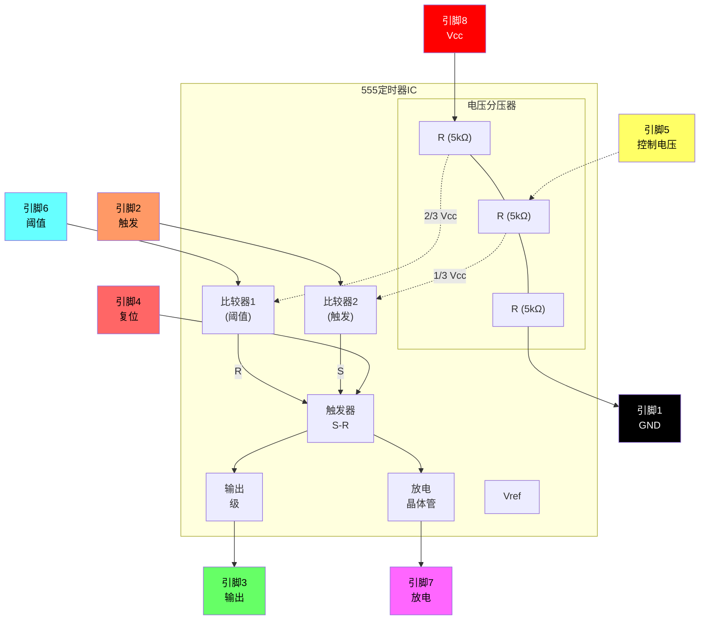
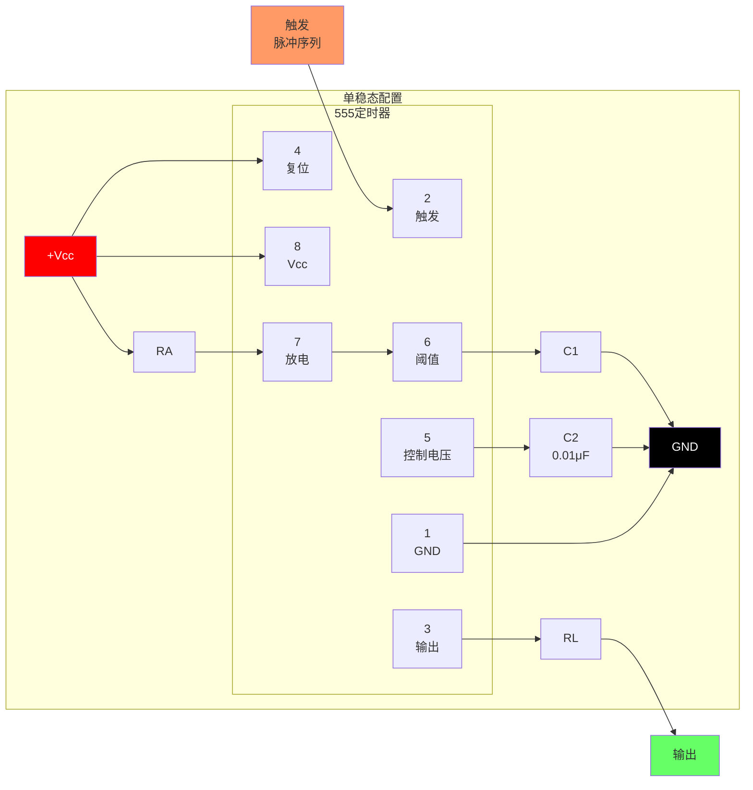
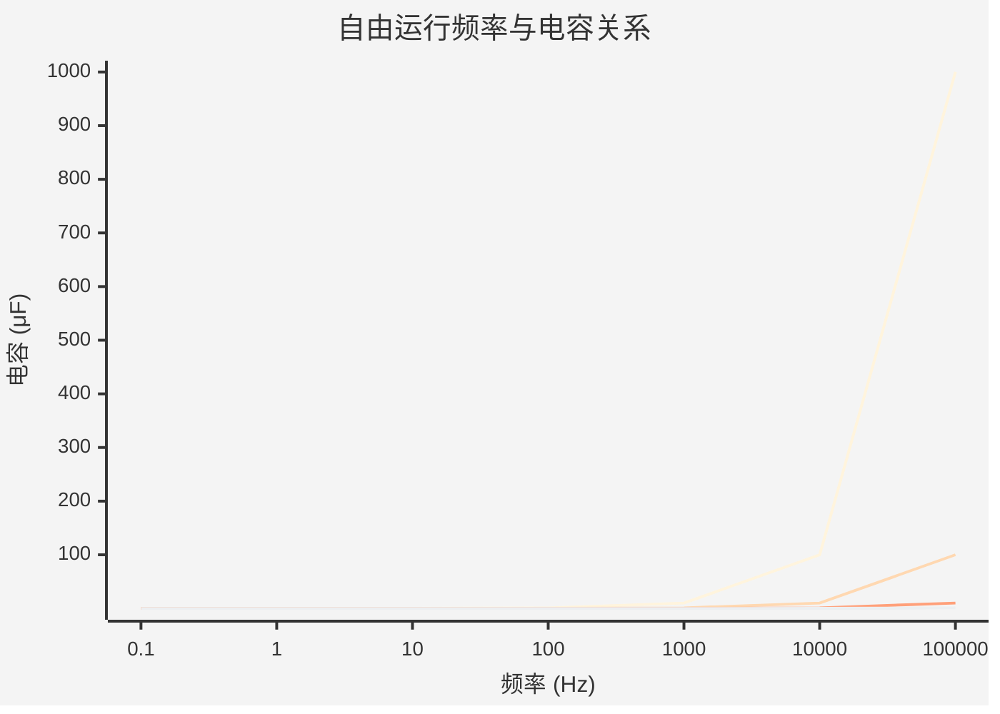
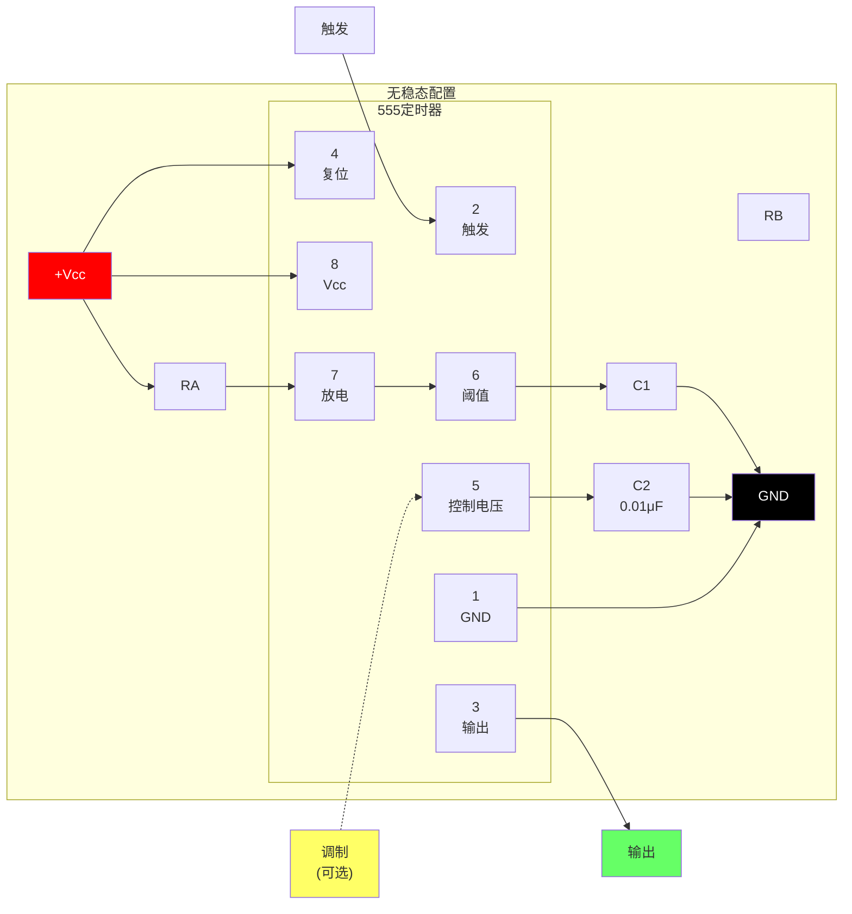
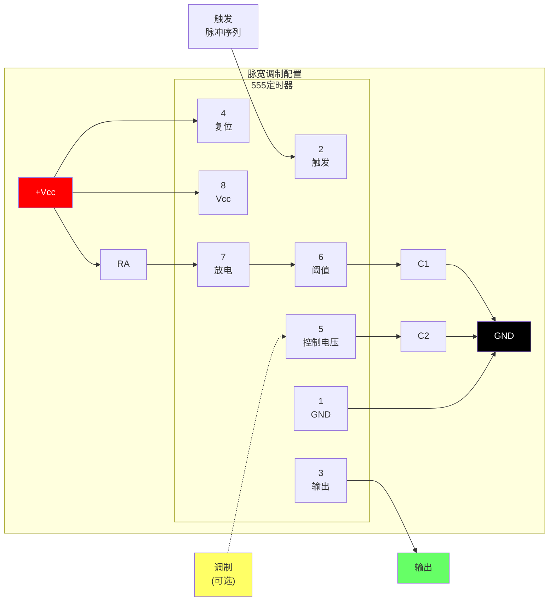
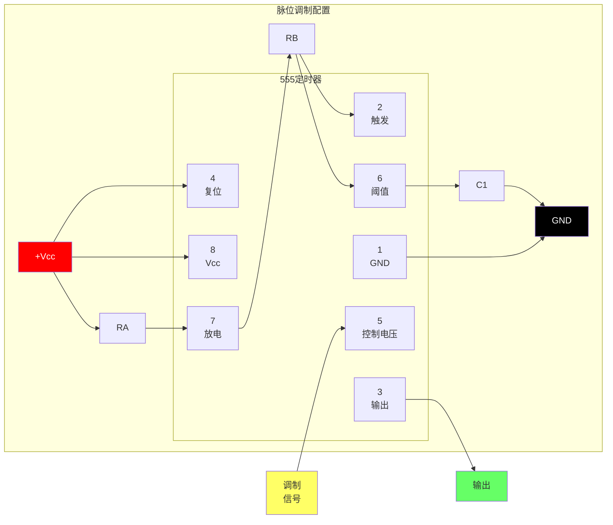
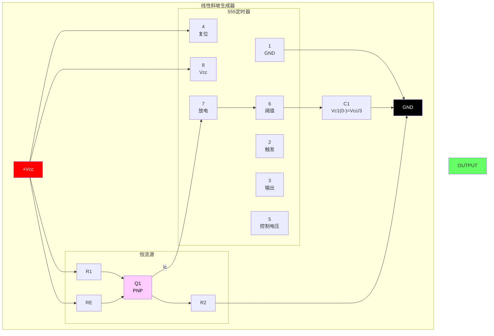

# 555

[www.fairchildsemi.com](www.fairchildsemi.com)

LM555/NE555/SA555 是一种高稳定控制器，能够产生精确的定时脉冲。在单稳态操作模式下，时间延迟由一个外部电阻和一个外部电容控制。在无稳态操作模式下，频率和占空比由两个外部电阻和一个外部电容精确控制。

## 特性

- 高电流驱动能力（200mA）
- 可调节占空比
- 温度稳定性为 0.005%/°C
- 定时范围从微秒到小时
- 关断时间小于 2μSec

## 应用

- 精密定时
- 脉冲生成
- 时间延迟生成
- 顺序定时

## 内部结构图



**引脚配置：**

| 引脚 | 名称 | 功能 |
|:---:|:---|:---|
| 1 | GND | 接地参考 |
| 2 | TRIG | 触发输入（低于 1/3 Vcc 开始定时） |
| 3 | OUT | 输出（高或低） |
| 4 | RESET | 低电平复位 |
| 5 | CONT | 控制电压（2/3 Vcc 参考） |
| 6 | THRES | 阈值输入（高于 2/3 Vcc 结束定时） |
| 7 | DISCH | 放电（开漏输出） |
| 8 | Vcc | 供电电压（+4.5V 到 +16V） |

## 绝对最大额定值（Ta = 25°C）

| 参数 | 符号 | 最大值 | 单位 |
| :--- | :--- | :--- | :--- |
| 供电电压 | Vcc | 16 | V |
| 引脚温度（10秒焊接） | Tled | 300 | °C |
| 功耗 | PD | 600 | mW |
| 工作温度范围<br>LM555/NE555<br>SA555 | Topr | -65 ~ +150 | °C |

## 电气特性

（Ta = 25°C，Vcc = 5V 到 15V，除非另有说明）

| 参数 | 符号 | 条件 | 最小值 | 典型值 | 最大值 | 单位 |
| :--- | :--- | :--- | :--- |:--- | :--- | :--- |
| 供电电压 | vcc | - | 4.5 | - | 16 | V |
| 供电电流（低稳定）（注1） | Icc | Vcc = 5V, Rl = ∞<hr>Vcc = 15V, Rl = ∞ | -<hr>- | 3<hr>7.5 | 6<hr>15 | mA<hr>mA |
| 定时误差（单稳态）<br>初始精度（注2）<br>温度漂移（注4）<br>供电电压漂移（注4） | ACCUR<br>Δt/ΔT<br>Δt/ΔVcc | Ra = 1kΩ 到 100kΩ<br>C = 0.1μF | - | 1.0<br>50<br>0.1 | 3.0<br><br>0.5 | %<br>ppm/°C<br>%/V |
| 定时误差（无稳态）<br>初始精度（注2）<br>温度漂移（注4）<br>供电电压漂移（注4） | ACCUR<br>Δt/ΔT<br>Δt/ΔVcc | Ra = 1kΩ 到 100kΩ<br>C = 0.1μF | - | 2.25<br>150<br>0.3 | - | %<br>ppm/°C<br>%/V |
| 控制电压 | Vc | Vcc = 15V<hr>Vcc = 5V | 9.0<hr>2.6 | 10.0<hr>3.33 | 11.0<hr>4.0 | V<hr>V |
| 阈值电压 | VTH | VCC = 15V<hr>VCC = 5V | -<hr>- | 10.0<hr>3.33 | -<hr>- | V<hr>V |
| 阈值电流（注3） | Ith | - | - | 0.1 | 0.25 | μA |
| 触发电压 | VTR | VCC = 5V<hr>VCC = 15V | 1.1<hr>4.5 | 1.67<hr>5 | 2.2<hr>5.6 | V<hr>V |
| 触发电流 | ITR | VTR = 0V | 0.01 | 2.0 | μA |
| 复位电压 | VRST | - | 0.4 | 0.7 | 1.0 | V |
| 复位电流 | IRST | - | 0.1 | 0.4 | mA |
| 低输出电压 | VOL | VCC = 15V<br>ISINK = 10mA<br>ISINK = 50mA<hr>VCC = 5V<br>ISINK = 5mA | -<hr>- | 0.06<br>0.3<hr>0.05 | 0.25<br>0.75<hr>0.35 | V<br>V<hr>V |
| 高输出电压 | VOH | VCC = 15V<br>ISOURCE = 200mA<br>ISOURCE = 100mA<hr>VCC = 5V<br>ISOURCE = 100mA | 12.75<hr>2.75 | 12.5<br>13.3<hr>3.3 | -<hr>- | V<br>V<hr>V |
| 输出上升时间（注4） | tR | - | - | 100 | - | ns |
| 输出下降时间（注4） | tF | - | - | 100 | - | ns |
| 放电漏电流 | ILKG | - | - | 20 | 100 | nA |

**注：**

1. 当输出为高电平时，供电电流通常比 Vcc = 5V 时低 1mA。
2. 在 Vcc = 5.0V 和 Vcc = 15V 条件下测试。
3. 这将决定 15V 操作下的 RA + RB 最大值，总电阻 R = 20MQ。对于 5V 操作，总电阻最大为 8.7MΩ。
4. 这些参数虽然有保证，但未在生产中 100% 测试。

## 应用信息

下表是 555 定时器的基本工作表：

| 阈值电压<br/>(Vth)(引脚6) | 触发电压<br/>(Vtr)(引脚2) | 复位(引脚4) | 输出(引脚3) | 放电Tr.<br/>(引脚7) |
| :--- | :--- | :--- | :--- | :--- |
| 无关 | 无关 | 低 | 低 | 开启 |
| Vth > 2Vcc/3 | Vth > 2Vcc/3 | 高 | 低 | 开启 |
| Vcc/3 < Vth < 2Vcc/3 | Vcc/3 < Vth < 2Vcc/3 | 高 | - | - |
| Vth < Vcc/3 | Vth < Vcc/3 | 高 | 高 | 关闭 |

当低电平信号施加到复位引脚时，定时器输出保持低电平，无论阈值电压如何。只有当高电平信号施加到复位引脚时，定时器输出才会根据阈值电压和触发电压变化。当阈值电压超过 2/3 供电电压时，定时器内部放电晶体管开启，将阈值电压降低至低于 1/3 供电电压，此时定时器输出保持低电平。之后，如果触发电压降至低于 1/3 供电电压，放电晶体管关闭，阈值电压上升，定时器输出再次变为高电平。在这个过程中，定时器输出高电平的时间是 VC1 从 Vcc/3 上升到 2Vcc/3 所需的时间，而输出低电平的时间是 VC1 从 2Vcc/3 下降到 Vcc/3 所需的时间。

### 1. 单稳态操作

#### 图1. 单稳态电路



**元件值：**

- RA：定时电阻（典型值 1kΩ 到 10MΩ）
- C1：定时电容
- C2：旁路电容（推荐 0.01μF）
- RL：负载电阻

**时间延迟公式：**
$$t_d = 1.1 \times R_A \times C_1$$

#### 图2. 电阻和电容与时间延迟（td）的关系



| RA | C1 | 时间延迟 (td) |
|:---|:---|:---|
| 1 kΩ | 0.1 μF | 110 μs |
| 10 kΩ | 0.1 μF | 1.1 ms |
| 100 kΩ | 0.1 μF | 11 ms |
| 1 MΩ | 1 μF | 1.1 s |
| 10 MΩ | 10 μF | 110 s |

#### 图3. 单稳态操作波形

```mermaid
%%{init: {'theme': 'base'}}%%
gantt
    title 单稳态波形（正常操作）
    dateFormat X
    axisFormat %s
    
    section 触发
    高 (Vcc)    :a1, 0, 2
    低 (<Vcc/3)  :crit, a2, 2, 3
    高 (Vcc)    :a3, 3, 10
    
    section 输出
    低 (0V)      :b1, 0, 2
    高 (Vcc)    :active, b2, 2, 8
    低 (0V)      :b3, 8, 10
    
    section 阈值 (Vc1)
    充电      :c1, 2, 8
```



```
    触发 ─────┐     ┌─────────────────────
    (引脚2)      └─────┘  
                    ↓ 触发脉冲
                    
    输出  ─────────┐                ┌───────────────
    (引脚3)         └──────────────┘
                    |←── td ───→|
                    
    阈值        /‾‾‾‾‾‾‾‾‾‾‾‾‾‾‾‾\
    (引脚6)    ─────/          \────
               0V  ↗            ↘  
                  Vcc/3      2Vcc/3
                  
    td = 1.1 × RA × C1
```

图1 展示了一个单稳态电路。在此模式下，每当触发电压低于 Vcc/3 时，定时器会生成一个固定脉冲。当触发脉冲电压施加到引脚2时，如果其低于 Vcc/3 而定时器输出为低电平，定时器内部的触发器会关闭放电晶体管，通过充电外部电容 C1 并同时设置触发器输出，使定时器输出变为高电平。外部电容 C1 上的电压 VC1 会以时间常数 t=RA*C 指数上升，并在 td=1.1RA*C 时达到 2Vcc/3。因此，电容 C1 通过电阻 RA 充电。时间常数 RAC 越大，VC1 达到 2Vcc/3 所需的时间就越长。换句话说，时间常数 RAC 控制输出脉冲宽度。当电容 C1 上的电压达到 2Vcc/3 时，触发端的比较器会重置触发器，使放电晶体管开启，电容 C1 开始放电，定时器输出再次变为低电平。这样，定时器在单稳态模式下重复上述过程。图2 显示了基于 RA 和 C 的时间常数关系。图3 展示了单稳态操作的一般波形。需要注意的是，在正常操作中，触发脉冲电压需要在定时器输出变为低电平之前保持至少 Vcc/3。即，即使在输出为高电平时施加不同的触发脉冲，也不会影响输出，但如果在输出脉冲结束时触发脉冲电压仍低于 Vcc/3，波形将无法正常工作。图4 展示了这种定时器输出异常。

#### 图4. 单稳态操作波形（异常）

```
    触发 ─────┐     ┌───────────────────────────
    (引脚2)      └─────┘  
                    ↓ 触发脉冲
                    
    输出  ─────────┐              ┌───────────────
    (引脚3)         └──────────────┘
                    |←──── td ────→|
                    
    阈值        /‾‾‾‾‾‾‾‾‾‾‾‾‾‾‾‾\
    (引脚6)    ─────/          \────
               0V  ↗            ↘  
                  Vcc/3      2Vcc/3
                  
    td = 1.1 × RA × C1
    ⚠️ 异常：触发保持低电平会延长输出脉冲！
    触发必须在输出变为低电平前恢复高电平。
```

**注：** 在正常操作中，触发脉冲电压必须在定时器输出变为低电平前恢复高于 Vcc/3。

### 2. 无稳态操作

#### 图5. 无稳态电路



**元件值：**

- RA：充电电阻（控制高电平时间）
- RB：充电/放电电阻（影响高电平和低电平时间）  
- C1：定时电容
- C2：旁路电容（推荐 0.01μF）

**定时公式：**

- 高电平时间：$t_H = 0.693 \times (R_A + R_B) \times C_1$
- 低电平时间：$t_L = 0.693 \times R_B \times C_1$
- 周期：$T = t_H + t_L = 0.693 \times (R_A + 2R_B) \times C_1$
- 频率：$f = \frac{1.44}{(R_A + 2R_B) \times C_1}$
- 占空比：$D = \frac{R_A + R_B}{R_A + 2R_B}$

#### 图6. 电容和电阻与频率的关系

```mermaid
%%{init: {'theme': 'base'}}%%
xychart-beta
    title "自由运行频率与电容关系"
    x-axis "频率 (Hz)" [0.1, 1, 10, 100, 1000, 10000, 100000]
    y-axis "电容 (μF)" 0.001 --> 100
```

| (RA + 2RB) | C1 | 频率 |
|:---|:---|:---|
| 1.44 kΩ | 1 μF | 1 kHz |
| 14.4 kΩ | 1 μF | 100 Hz |
| 144 kΩ | 1 μF | 10 Hz |
| 14.4 kΩ | 0.1 μF | 1 kHz |
| 10 MΩ | 10 μF | 110 s |

#### 图7. 无稳态操作波形

```
    输出  ────┐     ┌─────┐     ┌─────┐     ┌─────┐     ┌────
    (引脚3)    └─────┘     └─────┘     └─────┘     └─────┘
               |←t1→|←─t2──→|←─t3──→|←─t4──→|←─t5→|
               
    阈值        /\    /\      /\      /\    /\
    (引脚6)   ─────/  \──────/  \──────/  \────
              0V  ↗            ↘  
                  Vcc/3      2Vcc/3
                  
    tH = 0.693 × (RA + RB) × C1
    tL = 0.693 × RB × C1
    T = tH + tL = 0.693 × (RA + 2RB) × C1
```

**典型值：** RA = 1kΩ, RB = 1kΩ, C1 = 1μF, Vcc = 5V

通过在图1 的电路中添加电阻 RB 并配置为图5 所示，可以实现无稳态定时器操作。在无稳态操作中，触发端和阈值端连接以形成自触发，工作为多谐振荡器。当定时器输出为高电平时，其内部放电晶体管关闭，电容 C1 通过时间常数 (RA+RB)*C 指数上升，达到 2Vcc/3 时，定时器输出变为低电平。此时，C1 开始放电，定时器输出再次变为高电平。这样，定时器在无稳态模式下重复上述过程。图2 展示了基于 RA 和 C 的时间常数关系。图3 展示了无稳态操作的一般波形。需要注意的是，对于正常操作，触发脉冲电压需要在定时器输出变为低电平前保持至少 Vcc/3。即，即使在输出为高电平时施加不同的触发脉冲，也不会影响输出，但如果在输出脉冲结束时触发脉冲电压仍低于 Vcc/3，输出波形将无法正常工作。图4 展示了这种定时器输出异常。

### 3. 频率分频

通过调整定时周期的长度，图1 的基本电路可以配置为频率分频器。图8 展示了一个利用在定时周期内无法重新触发的特性实现的分频电路。

#### 图8. 频率分频操作波形

```
    触发 ─────┐  ┌──┐  ┌─────────────────
    (引脚2)      └──┘  └──┘  
                 ↓ 触发脉冲
                    
    输出  ─────────┐                ┌─────
    (引脚3)         └────────────────┘
                    |←── 延长的 td ──→|
                    
    阈值        /‾‾‾‾‾‾‾‾‾‾‾‾‾‾‾‾\
    (引脚6)    ─────/                  \────
               0V  ↗                    ↘  
                  Vcc/3              2Vcc/3
                  
    ⚙️ 分频（N）：设置定时，使输出忽略（N-1）个触发脉冲！
```

**注：** 对于正常操作，触发脉冲电压必须在定时器输出变为低电平前恢复高于 Vcc/3。

### 4. 脉宽调制

通过调节施加在定时器引脚5上的控制电压并改变定时器内部比较器的参考电压，定时器输出波形可以被改变。图9 展示了脉宽调制电路。当在单稳态模式下施加连续触发脉冲序列时，定时器输出宽度会根据施加到控制端的信号进行调制。正弦波或其他波形都可以作为控制端的信号。图10 展示了脉宽调制波形的一个示例。

#### 图9. 脉宽调制电路



#### 图10. 脉宽调制波形

```
    控制  ╭──────╮      ╭──────╮      ╭──────╮
    (引脚5)  │      │      │      │      │
          ───╯      ╰──────╯      ╰──────╯
             |← Modulation Signal (例如，正弦波) →|
                    
    触发 ─┐ ┌─┐ ┌─┐ ┌─┐ ┌─┐ ┌─┐ ┌─┐ ┌─┐ ┌─┐ ┌─
             └─┘ └─┘ └─┘ └─┘ └─┘ └─┘ └─┘ └─┘
             
    输出  ─┐        ┌──┐        ┌──┐        ┌──────
    (引脚3) └────────┘  └────────┘  └────────┘
             |←──── td ────→|
             
    阈值       /\        /\        /\
    (引脚6)   ─────/          \────────────
              0V  ↗            ↘  
                  Vcc/3      2Vcc/3
                  
    td = 1.1 × RA × C1
```

图1 展示了一个单稳态电路。在此模式下，定时器在触发电压低于 Vcc/3 时生成固定脉冲。当施加到引脚2的触发脉冲电压低于 Vcc/3 而定时器输出为低电平时，定时器内部的触发器会关闭放电晶体管，并通过充电外部电容 C1 和同时设置触发器输出，使定时器输出变为高电平。外部电容 C1 上的电压 VC1 会以时间常数 t=RA*C 指数上升，并在 td=1.1RA*C 时达到 2Vcc/3。因此，电容 C1 通过电阻 RA 充电。时间常数 RAC 越大，VC1 达到 2Vcc/3 所需的时间就越长。换句话说，时间常数 RAC 控制输出脉冲宽度。当电容 C1 上的电压达到 2Vcc/3 时，触发端的比较器会重置触发器，使放电晶体管开启。此时，C1 开始放电，定时器输出转换为低电平。这样，定时器在单稳态模式下重复上述过程。图2 展示了基于 RA 和 C 的时间常数关系。图3 展示了单稳态操作的一般波形。需要注意的是，对于正常操作，触发脉冲电压需要在定时器输出变为低电平前保持至少 Vcc/3。即，即使在输出为高电平时施加不同的触发脉冲，也不会影响输出，但如果在输出脉冲结束时触发脉冲电压仍低于 Vcc/3，输出脉冲将被异常延长。图4 展示了这种定时器输出异常。

### 5. 脉位调制

如果在图11 所示的配置中，将定时器连接为无稳态操作，并将调制信号施加到控制端，定时器将成为脉位调制器。在脉位调制器中，定时器内部比较器的参考电压被调制，从而根据施加到控制端的调制信号调制定时器输出。图12 展示了使用正弦波作为调制信号和由此产生的输出脉位调制波形，但任何波形都可以使用。

#### 图11. 脉位调制电路



#### 图12. 脉位调制波形

```
    控制  ╭────────────╮          ╭────────────╮
    (引脚5)  │            │          │            │
          ───╯            ╰──────────╯            ╰───
             |←t1→|←─t2─→|←─t3─→|←─t4─→|←─t5→|
             
    脉冲间隔随控制电压变化：
    - 更高的控制电压 → 更长的周期
    - 更低的控制电压 → 更短的周期
    
    RA = 1kΩ, RB = 1kΩ, C1 = 1nF, Vcc = 5V
```

### 6. 线性斜坡

通过将图1 中的拉电流电阻 RA 替换为恒流源，基本电路可以作为频率分频器运行。图13 展示了线性斜坡生成电路，图14 展示了生成的线性斜坡波形。

#### 图13. 线性斜坡电路



#### 图14. 线性斜坡波形

```
    触发 ─────┐     ┌───────────────────────────
    (引脚2)      └─────┘  
                    ↓ 触发脉冲
                    
    输出  ─────────┐              ┌───────────────
    (引脚3)         └──────────────┘
                    |←──── td ────→|
                    
    阈值        /‾‾‾‾‾‾‾‾‾‾‾‾‾‾‾‾\
    (引脚6)    ─────/          \────
               0
