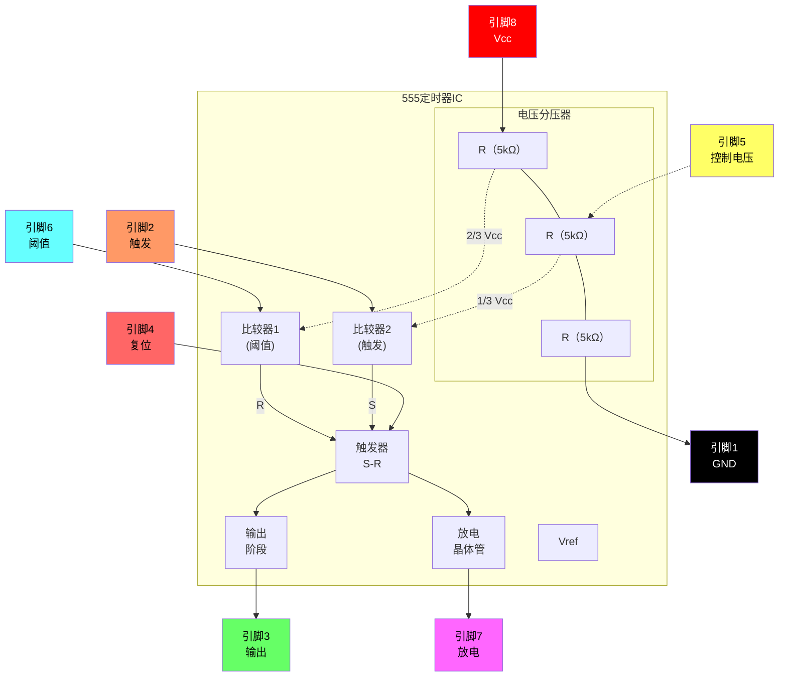

# 连接电子元件

本指南提供了在面包板上构建电子电路的逐步说明。每个构建逐步引入新的元件和概念。

---

## 基础元件构建说明

### 构建 1 — 单个LED

**元件：** 红色LED、黑色跳线、红色跳线、带夹子的电池

**步骤：**

1. 将黑色跳线插入面包板，从 **A5** 连接到 **A14**。
2. 将红色跳线插入面包板，从 **J5** 连接到 **J14**。
3. 将红色LED插入面包板第14行，较长的腿（正极）位于右侧，与红色跳线对齐，较短的腿（负极）位于左侧，与黑色跳线对齐。
4. 将电池插入其夹子中，并放置在面包板上，将负极连接到黑色跳线，正极连接到红色跳线。

**结果：** 插入电池后，LED将点亮。

**故障排除：**

- LED 是否反向插入？
- 跳线是否与LED引脚位于同一行？
- 跳线是否与电池端子位于同一行？

---

### 构建 2 — 单个按键开关

**元件：** 红色LED、按键开关、黑色跳线、红色跳线、带夹子的电池

**步骤：**

1. 将黑色跳线插入面包板，从 **A5** 连接到 **A16**。
2. 将红色跳线插入面包板，从 **J5** 连接到 **J12**。
3. 将红色LED插入面包板，较长的腿（正极）插入 **H15**，较短的腿（负极）插入 **G17**。
4. 将按键开关水平放置在面包板中间，使其左下引脚位于第16行（与黑色跳线对齐），右上引脚位于第14行（与红色LED的负极对齐）。
5. 将电池插入其夹子中，并放置在面包板上，将负极连接到黑色跳线，正极连接到红色跳线。

**结果：** 插入电池后，绿色LED将点亮。按下按键开关时，绿色LED将熄灭，红色LED将点亮。

---

### 构建 3 — 光敏电阻调光LED

**元件：** 绿色LED、光敏电阻、黑色跳线、红色跳线、带夹子的电池

**步骤：**

1. 将黑色跳线插入面包板，从 **A5** 连接到 **A12**。
2. 将红色跳线插入面包板，从 **J5** 连接到 **J13**。
3. 将绿色LED插入面包板，较长的腿（正极）插入 **F13**，较短的腿（负极）插入 **E13**。
4. 将光敏电阻插入面包板，从 **C12** 连接到 **D13**。
5. 将电池插入其夹子中，并放置在面包板上，将负极连接到黑色跳线，正极连接到红色跳线。

**结果：** 插入电池后，LED将点亮。遮挡光敏电阻会使LED的亮度降低。

---

## 555定时器IC参考

555定时器是一种多功能集成电路，用于定时、脉冲生成和振荡器应用。以下部分提供了引脚分配信息和内部电路细节。

### 555引脚分配图

```
    ┌─────────────────────────────────────┐
    │  ●                                  │
    │  #1                             #8  │
    │  ┌──┐                         ┌──┐  │
    │  │  │                         │  │  │
    │  └──┘                         └──┘  │
    │  #2                             #7  │
    │  ┌──┐       555定时器         ┌──┐  │
    │  │  │                         │  │  │
    │  └──┘                         └──┘  │
    │  #3                             #6  │
    │  ┌──┐                         ┌──┐  │
    │  │  │                         │  │  │
    │  └──┘                         └──┘  │
    │  #4                             #5  │
    │  ┌──┐                         ┌──┐  │
    │  │  │                         │  │  │
    │  └──┘                         └──┘  │
    └─────────────────────────────────────┘
```

### 555引脚功能描述

| 引脚 | 符号 | 功能 |
|:---:|:---:|:---|
| 1 | GND | 地参考（0V） |
| 2 | TRIG | 触发输入 — 当电压低于1/3 Vcc时启动定时周期 |
| 3 | OUT | 输出 — 提供高或低信号 |
| 4 | RESET | 复位输入（低电平有效） — 接地时强制输出低电平 |
| 5 | CONT | 控制电压 — 提供对内部电压分压器（2/3 Vcc）的访问 |
| 6 | THRES | 阈值输入 — 当电压超过2/3 Vcc时结束定时周期 |
| 7 | DISCH | 放电 — 用于放电定时电容的开集电极输出 |
| 8 | Vcc | 供电电压（+4.5V至+16V） |

### 555内部结构图



---

### 构建 6 — 按键开关蜂鸣器

**元件：** 555定时器IC、压电蜂鸣器、光敏电阻、1000Ω电阻、电容、按键开关、跳线、带夹子的电池

**步骤：**

1. 将黑色跳线插入面包板，从 **A1** 连接到 **A11**。
2. 将红色跳线插入面包板，从 **J1** 连接到 **J11**。
3. 将555集成电路芯片放置在面包板中间，顶部引脚位于第11行。
4. 将跳线插入面包板，连接 **D12** 到 **G13**。
5. 将跳线插入面包板，连接 **D14** 到 **G11**。
6. 将电容插入面包板，从 **A12** 连接到 **B11**。
7. 将光敏电阻插入面包板，从 **C12** 连接到 **C13**。
8. 将按键开关水平放置在面包板中间，使其顶部引脚位于 **E15** 和 **F15**。
9. 将220Ω电阻插入面包板，从 **E6** 连接到 **A13**。
10. 将跳线插入面包板，连接 **E9** 到 **D15**。
11. 将跳线插入面包板，连接 **G17** 到 **I11**。
12. 将电位器放置在面包板上，双引脚侧位于右侧，顶部引脚位于 **F7**，底部引脚位于 **F9**。
13. 将跳线插入面包板，连接 **D8** 到 **B13**。
14. 将跳线插入面包板，连接 **H7** 到 **C12**。
15. 将跳线插入面包板，连接 **H9** 到 **D11**。
16. 将电池插入其夹子中，并放置在面包板上，将负极连接到黑色跳线，正极连接到红色跳线。

**结果：** 按下按键开关会使蜂鸣器发声。旋转电位器会改变蜂鸣器的音调。
