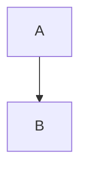

# 代码块转HTML

## 围栏代码块（无语言标识）

### Markdown

```
function test() {
  console.log("notice the blank line before this function?");
}
```

### 解析后的HTML

```html
<pre><code>
function test() {
  console.log("notice the blank line before this function?");
}
</code></pre>
```

---

## GitHub提示框

### Markdown

```md
> [!TIP]
> 为了在列表中保留格式，请确保对非围栏代码块进行八格空格的缩进。
```

### 解析后的HTML（GitHub专用）

```html
<blockquote class="markdown-alert markdown-alert-tip">
  <p><strong>提示</strong></p>
  <p>为了在列表中保留格式，请确保对非围栏代码块进行八格空格的缩进。</p>
</blockquote>
```

---

## 在代码块中显示反引号

### Markdown

`````md
    ````
    ```
    Look! You can see my backticks.
    ```
    ````
`````

### 解析后的HTML

```html
    <pre><code class="language-mermaid">
    ```

    Look! You can see my backticks.

    ```
    </code></pre>
```

## 语法高亮（语言标识符）

### Markdown

```ruby
require 'redcarpet'
markdown = Redcarpet.new("Hello World!")
puts markdown.to_html
```

### 解析后的HTML

```html
<pre><code class="language-ruby">
require 'redcarpet'
markdown = Redcarpet.new("Hello World!")
puts markdown.to_html
</code></pre>
```

> `language-ruby`类由GitHub的语法高亮器（Linguist + grammar）使用。

### 总结：语法高亮规则（HTML级别）

| Markdown围栏 | 解析后的`<code>`标签            |
| ------------ | ------------------------------ |
| ```js        | `<code class="language-js">`   |
| ```html      | `<code class="language-html">` |
| ```md        | `<code class="language-md">`   |
| ```（无语言）| `<code>`                       |

---

## HTML注释（渲染器忽略）

```md
<!-- 内部文档注释 -->
```

```html
<!-- 内部文档注释 -->
```

---

## 链接

```md
[关于在GitHub上撰写和格式化的说明](https://docs.github.com/...)
```

```html
<a href="https://docs.github.com/...">关于在GitHub上撰写和格式化的说明</a>
```

---

## 列表

```md
* [GitHub Flavored Markdown规范](https://github.github.com/gfm/)
```

```html
<ul>
  <li>
    <a href="https://github.github.com/gfm/">GitHub Flavored Markdown规范</a>
  </li>
</ul>
```

---

## 图表（概念性解析）

### Markdown

````md

````

### 解析后的HTML

```html
<pre><code class="language-mermaid">
graph TD
  A --> B
</code></pre>
```

## 结尾说明

* 此处没有`language-*`类，因为**未提供语言标识符**。
* 内部的三重反引号作为**纯文本**被保留于`<code>`标签内。
