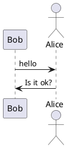
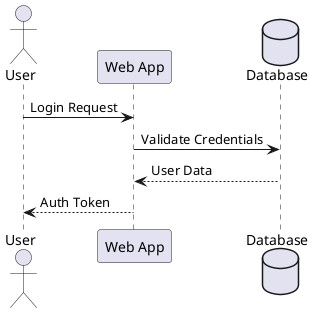
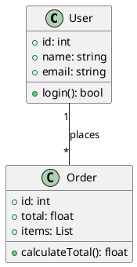
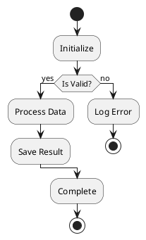
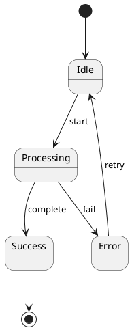
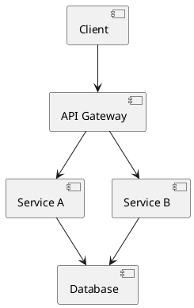
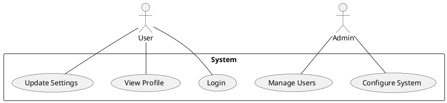
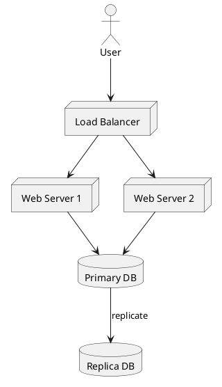

# PlantUML ASCII艺术图生成器

## 概述

使用PlantUML创建基于文本的ASCII艺术图。非常适合在终端环境中、README文件、电子邮件或任何不适合使用图形图的场景中的文档编写。

## 什么是PlantUML ASCII艺术图？

PlantUML可以生成纯文本（ASCII艺术）格式的图，而不是图像。这在以下场景中非常有用：

- 基于终端的工作流程
- 不支持图像的Git提交/PR
- 需要版本控制的文档
- 无法使用图形工具的环境

## 安装

```bash
# macOS
brew install plantuml

# Linux（根据发行版不同）
sudo apt-get install plantuml  # Ubuntu/Debian
sudo yum install plantuml      # RHEL/CentOS

# 或者直接下载JAR文件
wget https://github.com/plantuml/plantuml/releases/download/v1.2024.0/plantuml-1.2024.0.jar
```

## 输出格式

| 标志    | 格式        | 描述                          |
| ------- | ------------- | ------------------------------------ |
| `-txt`  | ASCII         | 纯ASCII字符                |
| `-utxt` | Unicode ASCII | 增强的框线字符 |

## 基本工作流程

### 1. 创建PlantUML图文件



### 2. 生成ASCII艺术图

```bash
# 标准ASCII输出
plantuml -txt diagram.puml

# 增强的Unicode输出（视觉效果更好）
plantuml -utxt diagram.puml

# 直接使用JAR文件
java -jar plantuml.jar -txt diagram.puml
java -jar plantuml.jar -utxt diagram.puml
```

### 3. 查看输出

输出将保存为`diagram.atxt`（ASCII）或`diagram.utxt`（Unicode）。

## 支持的图类型

### 序列图



### 类图



### 活动图



### 状态图



### 组件图



### 用例图



### 部署图



## 命令行选项

```bash
# 指定输出目录
plantuml -txt -o ./output diagram.puml

# 处理目录中的所有文件
plantuml -txt ./diagrams/

# 包含隐藏文件（dot文件）
plantuml -txt -includeDot diagrams/

# 显示详细输出
plantuml -txt -v diagram.puml

# 指定字符集
plantuml -txt -charset UTF-8 diagram.puml
```

## Ant任务集成

```xml
<target name="generate-ascii">
  <plantuml dir="./src" format="txt" />
</target>

<target name="generate-unicode-ascii">
  <plantuml dir="./src" format="utxt" />
</target>
```

## 生成更佳ASCII图的技巧

1. **保持简洁**：复杂的图在ASCII中渲染效果不佳
2. **使用简短标签**：长文本会破坏ASCII的对齐
3. **使用Unicode (`-utxt`)**：通过框线字符提升视觉效果
4. **分享前测试**：在终端中使用固定宽度字体验证
5. **考虑替代方案**：对于复杂图，建议使用Mermaid.js或graphviz

## 示例输出对比

**标准ASCII (`-txt`)**:

```
     ,---.          ,---.
     |Bob|          |Alice|
     `---'          `---'
      |   hello      |
      |------------->|
      |              |
      |  Is it ok?   |
      |<-------------|
      |              |
```

**Unicode ASCII (`-utxt`)**:

```
┌─────┐        ┌─────┐
│ Bob │        │Alice│
└─────┘        └─────┘
  │   hello      │
  │─────────────>│
  │              │
  │  Is it ok?   │
  │<─────────────│
  │              │
```

## 快速参考

```bash
# 创建ASCII格式的序列图
cat > seq.puml << 'EOF'
@startuml
Alice -> Bob: Request
Bob --> Alice: Response
@enduml
EOF

plantuml -txt seq.puml
cat seq.atxt

# 使用Unicode创建
plantuml -utxt seq.puml
cat seq.utxt
```

## 常见问题排查

**问题**: 乱码的Unicode字符

- **解决方案**: 确保终端支持UTF-8并使用合适的字体

**问题**: 图看起来不对齐

- **解决方案**: 使用等宽字体（Courier, Monaco, Consolas）

**问题**: 命令未找到

- **解决方案**: 安装PlantUML或直接使用Java JAR文件

**问题**: 输出文件未生成

- **解决方案**: 检查文件权限，确保PlantUML具有写入权限
