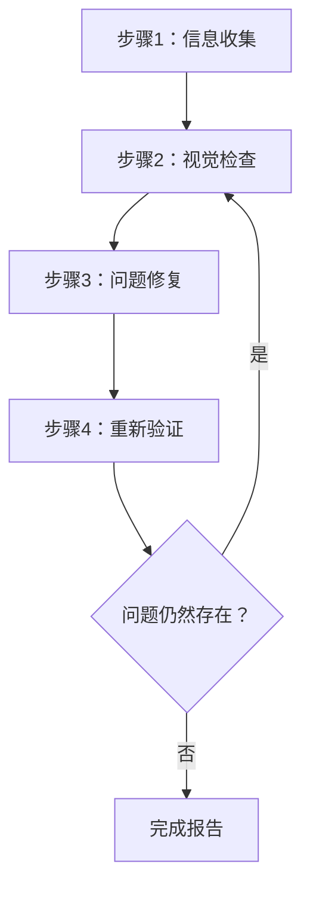
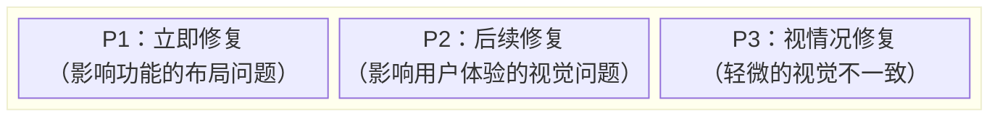
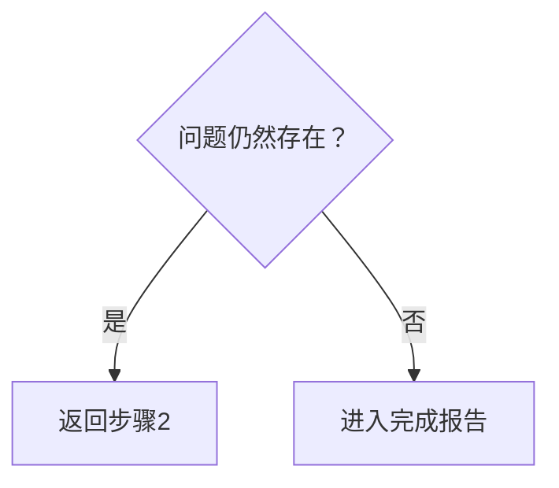

---
名称：Web设计审查员
描述：'此技能可对本地或远程运行的网站进行视觉检查，以识别和修复设计问题。触发请求如“审查网站设计”、“检查用户界面”、“修复布局”、“查找设计问题”。检测响应式设计、可访问性、视觉一致性及布局破坏等问题，并在源代码层面进行修复。'

---

# Web设计审查员

此技能可对网站设计进行视觉检查和验证，识别并修复源代码层面的问题。

## 应用范围

- 静态网站（HTML/CSS/JS）
- 单页应用（SPA）框架，如 React / Vue / Angular / Svelte
- 全栈框架，如 Next.js / Nuxt / SvelteKit
- 内容管理系统（CMS）平台，如 WordPress / Drupal
- 任何其他网络应用

## 前提条件

### 必需条件

1. **目标网站必须正在运行**
   - 本地开发服务器（例如 `http://localhost:3000`）
   - 测试环境
   - 生产环境（仅用于只读审查）

2. **必须具备浏览器自动化功能**
   - 截图捕获
   - 页面导航
   - DOM信息检索

3. **必须有源代码访问权限（进行修复时）**
   - 项目必须存在于工作空间中

## 工作流程概览



---

## 步骤1：信息收集阶段

### 1.1 URL确认

如果未提供URL，请向用户询问：

> 请提供要审查的网站URL（例如 `http://localhost:3000`）

### 1.2 项目结构理解

在进行修复时，收集以下信息：

| 项目 | 示例问题 |
|------|------------------|
| 框架 | 您是否使用React / Vue / Next.js等？ |
| 样式方法 | CSS / SCSS / Tailwind / CSS-in-JS等 |
| 源代码位置 | 样式文件和组件位于何处？ |
| 审查范围 | 仅特定页面还是整个网站？ |

### 1.3 自动项目检测

尝试从工作空间中的文件自动检测：

```
检测目标：
├── package.json     → 框架和依赖项
├── tsconfig.json    → TypeScript使用情况
├── tailwind.config  → Tailwind CSS
├── next.config      → Next.js
├── vite.config      → Vite
├── nuxt.config      → Nuxt
└── src/ 或 app/     → 源代码目录
```

### 1.4 识别样式方法

| 方法 | 检测方式 | 编辑目标 |
|--------|-----------|-------------|
| 纯CSS | `*.css`文件 | 全局CSS或组件CSS |
| SCSS/Sass | `*.scss`, `*.sass` | SCSS文件 |
| CSS Modules | `*.module.css` | 模块CSS文件 |
| Tailwind CSS | `tailwind.config.*` | 组件中的className |
| styled-components | 代码中的`styled.` | JS/TS文件 |
| Emotion | `@emotion/`导入 | JS/TS文件 |
| 其他CSS-in-JS | 内联样式 | JS/TS文件 |

---

## 步骤2：视觉检查阶段

### 2.1 页面遍历

1. 导航至指定URL
2. 捕获截图
3. 获取DOM结构/快照（如可能）
4. 如果存在其他页面，通过导航进行遍历

### 2.2 检查项目

#### 布局问题

| 问题 | 描述 | 严重程度 |
|-------|-------------|----------|
| 元素溢出 | 内容超出父元素或视口 | 高 |
| 元素重叠 | 未预期的元素重叠 | 高 |
| 对齐问题 | 网格或弹性布局对齐问题 | 中等 |
| 空间不一致 | padding/margin不一致 | 中等 |
| 文字裁剪 | 长文字未正确处理 | 中等 |

#### 响应式问题

| 问题 | 描述 | 严重程度 |
|-------|-------------|----------|
| 不适配移动端 | 小屏幕下布局损坏 | 高 |
| 突变点问题 | 屏幕尺寸变化时过渡不自然 | 中等 |
| 触摸目标 | 移动端按钮过小 | 中等 |

#### 可访问性问题

| 问题 | 描述 | 严重程度 |
|-------|-------------|----------|
| 对比度不足 | 文字与背景的对比度不足 | 高 |
| 缺少焦点状态 | 键盘导航时无法确定状态 | 高 |
| 缺少alt文字 | 图像缺少替代文字 | 中等 |

#### 视觉一致性

| 问题 | 描述 | 严重程度 |
|-------|-------------|----------|
| 字体不一致 | 混用字体家族 | 中等 |
| 颜色不一致 | 品牌颜色不统一 | 中等 |
| 空间不一致 | 相似元素之间间距不一致 | 低 |

### 2.3 视口测试（响应式）

在以下视口进行测试：

| 名称 | 宽度 | 代表设备 |
|------|-------|----------------------|
| 移动端 | 375px | iPhone SE/12 mini |
| 平板 | 768px | iPad |
| 桌面端 | 1280px | 标准PC |
| 宽屏 | 1920px | 大型显示器 |

---

## 步骤3：问题修复阶段

### 3.1 问题优先级



### 3.2 识别源文件

从问题元素中识别源文件：

1. **基于选择器的搜索**
   - 通过类名或ID搜索代码库
   - 使用 `grep_search` 探索样式定义

2. **基于组件的搜索**
   - 通过元素文本或结构识别组件
   - 使用 `semantic_search` 探索相关文件

3. **文件模式过滤**
   ```
   样式文件：src/**/*.css, styles/**/*
   组件：src/components/**/*
   页面：src/pages/**, app/**
   ```

### 3.3 应用修复

#### 框架特定修复指南

详见 [references/framework-fixes.md](references/framework-fixes.md)。

#### 修复原则

1. **最小化修改**：仅进行必要的最小修改以解决问题
2. **遵循现有代码风格**：按照项目现有代码风格进行修复
3. **避免破坏性修改**：注意不要影响其他区域
4. **添加注释**：在适当的地方添加注释解释修复原因

---

## 步骤4：重新验证阶段

### 4.1 修复后确认

1. 重新加载浏览器（或等待开发服务器的HMR）
2. 捕获修复区域的截图
3. 对比修复前后的效果

### 4.2 回归测试

- 验证修复未影响其他区域
- 确认响应式显示未被破坏

### 4.3 迭代决策



**迭代限制**：若某一问题需要超过3次修复尝试，需与用户协商

---

## 输出格式

### 审查结果报告

```markdown
# Web设计审查结果

## 概述

| 项目 | 值 |
|------|-------|
| 目标URL | {URL} |
| 框架 | {检测到的框架} |
| 样式 | {CSS / Tailwind / 等} |
| 测试视口 | 桌面端、移动端 |
| 检测到的问题 | {N} |
| 修复的问题 | {M} |

## 检测到的问题

### [P1] {问题标题}

- **页面**：{页面路径}
- **元素**：{选择器或描述}
- **问题**：{问题的详细描述}
- **修复文件**：`{文件路径}`
- **修复详情**：{修改描述}
- **截图**：修复前后

### [P2] {问题标题}
...

## 未修复的问题（如有）

### {问题标题}
- **原因**：{未修复/无法修复的原因}
- **建议操作**：{对用户的建议}

## 建议

- {未来改进的建议}
```

---

## 必需能力

| 能力 | 描述 | 必需 |
|------------|-------------|----------|
| 网页导航 | 访问URL、页面跳转 | ✅ |
| 截图捕获 | 页面图像捕获 | ✅ |
| 图像分析 | 视觉问题检测 | ✅ |
| DOM检索 | 页面结构检索 | 推荐 |
| 文件读写 | 源代码的读取和编辑 | 修复时必需 |
| 代码搜索 | 项目内代码搜索 | 修复时必需 |

---

## 参考实现

### 使用Playwright MCP的实现

[Playwright MCP](https://github.com/microsoft/playwright-mcp) 是推荐用于此技能的参考实现。

| 能力 | Playwright MCP工具 | 用途 |
|------------|---------------------|---------|
| 导航 | `browser_navigate` | 访问URL |
| 快照 | `browser_snapshot` | 获取DOM结构 |
| 截图 | `browser_take_screenshot` | 视觉检查的图像 |
| 点击 | `browser_click` | 与交互元素互动 |
| 改变尺寸 | `browser_resize` | 响应式测试 |
| 控制台 | `browser_console_messages` | 检测JS错误 |

#### MCP服务器配置示例

```json
{
  "mcpServers": {
    "playwright": {
      "command": "npx",
      "args": ["-y", "@playwright/mcp@latest", "--caps=vision"]
    }
  }
}
```

### 其他兼容的浏览器自动化工具

| 工具 | 功能 |
|------|----------|
| Selenium | 广泛的浏览器支持，多语言支持 |
| Puppeteer | 专注于Chrome/Chromium，基于Node.js |
| Cypress | 与端到端测试的易集成性 |
| WebDriver BiDi | 标准化的下一代协议 |

只要这些工具提供必要的能力（导航、截图、DOM检索），即可使用相同的流程进行实现。工具选择具有灵活性。

---

## 最佳实践

### 应做（推荐）

- ✅ 修复前始终保存截图
- ✅ 一次修复一个问题并逐一验证
- ✅ 遵循项目的现有代码风格
- ✅ 在进行重大修改前确认用户
- ✅ 详细记录修复细节

### 不应做（不推荐）

- ❌ 未经确认的大规模重构
- ❌ 忽略设计系统或品牌指南
- ❌ 忽略性能的修复
- ❌ 一次修复多个问题（难以验证）